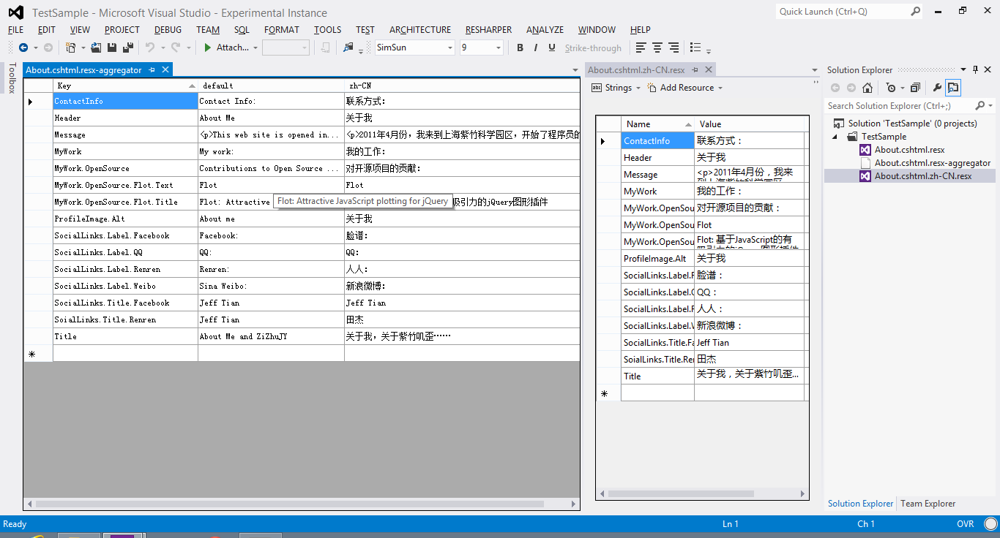
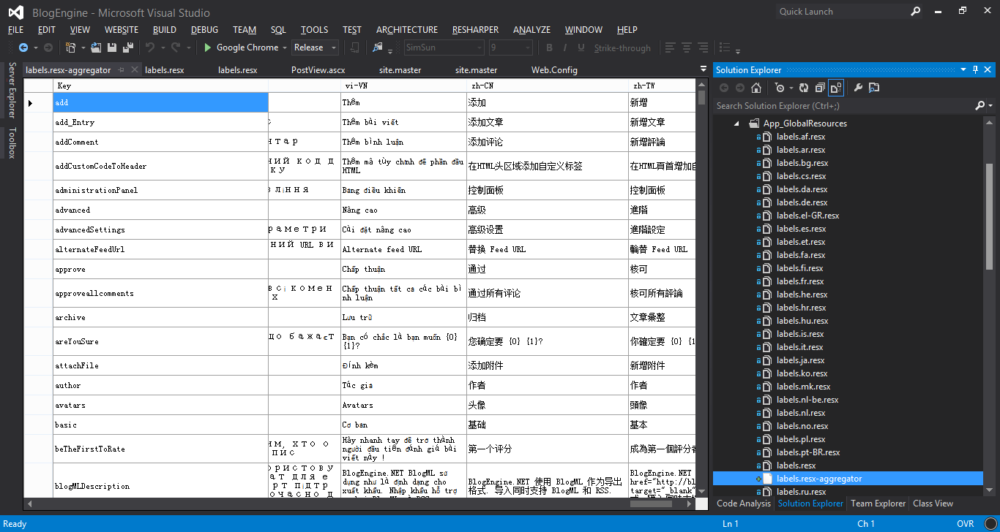

ResX-Aggregator
===============

Easy the resource(.resx) file editing. 

**Feature**

Aggregate all the .resx files into one editor.

If you have these .resx files under a folder:
- index.cshtml.resx
- index.cshtml.en-US.resx
- index.cshtml.zh-CN.resx

It's annoying that edit them one by one. Why don't edit them all in a single file?

Now with ResXAggregator, you can add a file that named "index.cshtml.resx-aggregator", and then open it in visual studio, it will allow you edit all the different cultures and save them back in just one single editor. It displays all the resource settings as this way:

	| Name            | default                  | en-US                | zh-CN       |
	| CloseLinkDialog | Stäng                    | Close                | 关闭         |
	| CloseMsg        | Stäng meddelandefönstret | Close message window | 关闭消息窗口 |
	| CloseTips       | Stäng hjälp              | Close help           | 关闭帮助     |

**Screenshot**

